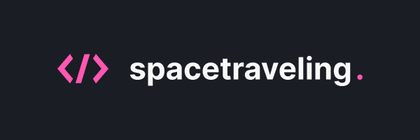
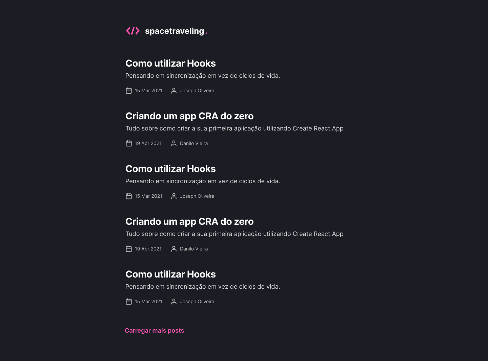
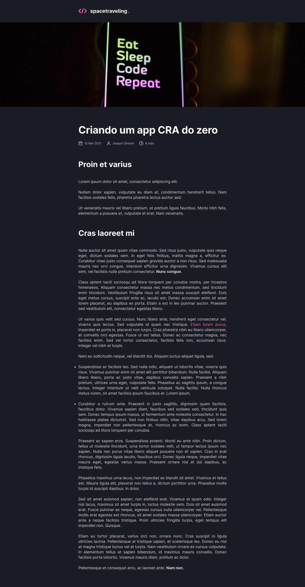

# Ignite Trilha React - Desafio 03



<h2 align="center">
  Get Static Props, Get Static Paths, Prismic
</h2>

<p align="center">
  

  

  

</p>

## :eyes: Preview da aplicação





## :rocket: Sobre o desafio

Neste desafio foram aplicados conceitos de geração estática de páginas usando Next.Js e gerenciamento de conteúdo utilizando o CMS Prismic.

Principais funcionalidades:

- Configurar repositório e modelo de documento no CMS Prismic;
- Buscar e listar na página o conteúdo gerado pelo Prismic de forma estática;
- Criar rotas dinâmicas levando ao conteúdo completo de cada post;
- Gerar de forma estática cada página de post através do Get Static Paths;
- Funcionalidade de paginação, mostrando mais posts, se houverem;

## :wrench: Instalação e Execução

- Clonar o repositório

```
> git clone https://github.com/holymos/rocketseat-ignite-desafio03-criando-projeto-do-0
```

- Entrar no diretório do projeto

```
> cd rocketseat-ignite-desafio03-criando-projeto-do-0
```

- Instalar as dependências com o Yarn ou npm

```
yarn  ||  npm i
```

- Rodar a suite de testes

```
yarn test  ||  npm test
```

- Executar o projeto

```
yarn dev  ||  npm run dev
```
